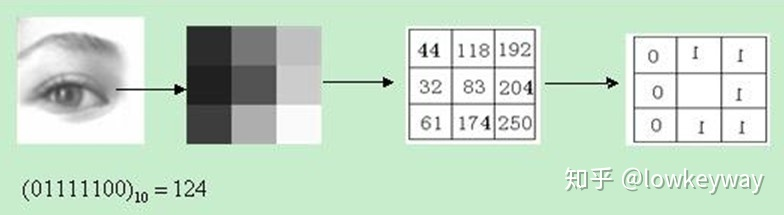
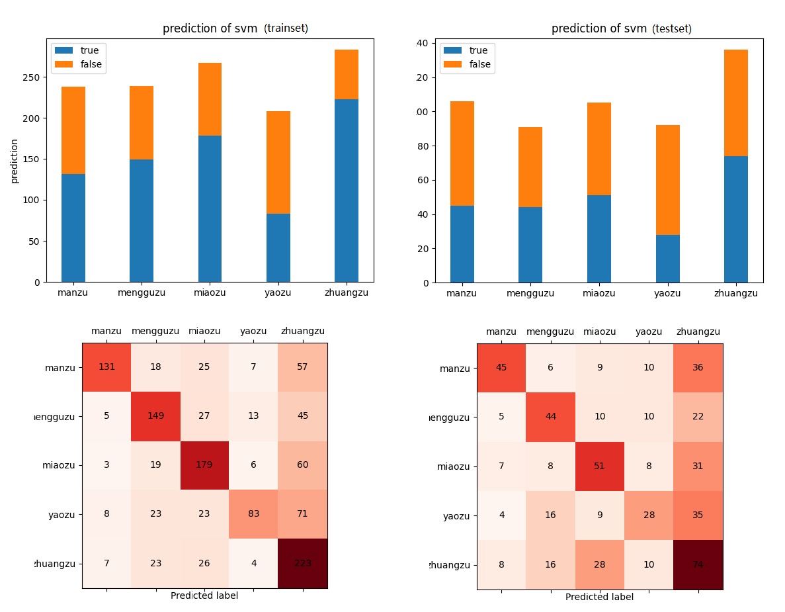
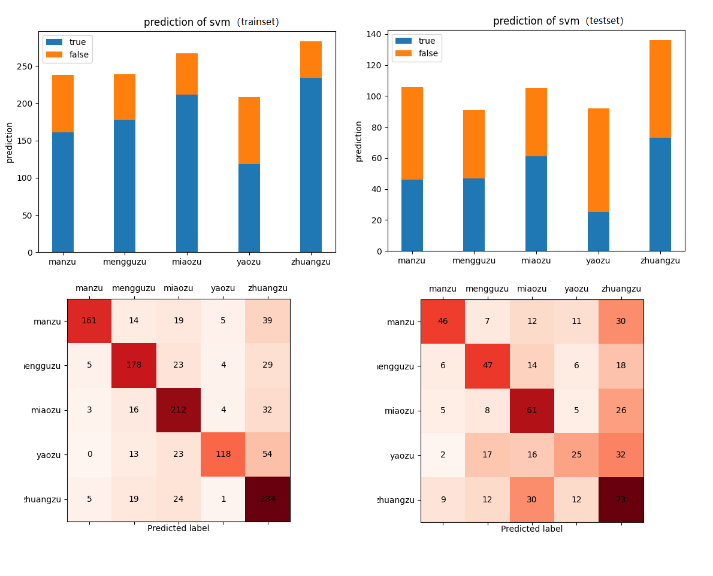

## LBP特征提取
LBP（Local Binary Pattern，局部二值模式）是一种用来描述图像局部纹理特征的算子；它具有灰度不变性的优点.



1. 在3*3的窗口内，以窗口中心像素为阈值，将相邻的8个像素的灰度值与其进行比较;
2. 若周围像素值大于中心像素值，则该像素点的位置被标记为1，否则为0;
3. 3*3邻域内的8个点经比较可产生8位二进制数;
4. 将该二进制数转换为十进制做为该像素点处的LBP特征值。

### 分类特征提取
对图像提取得到LBP的特征尺寸与输入图像相同，而分类器算法输入要求同一的输入尺寸，因此还需要对提取的LBP特征做处理，以便从不同尺寸的图像获得相同维度的输入特征。
这里采用的使分区域直方图的方式，对LBP特征统计直方图作为分类器的输入信息。
1. 设定分区数量WN和HN,即图像宽度和高度方向分别的划分数量（划分区域的数量将直接影响分类效果）；
2. 使用划分设置将输入的LBP特征划分区域，并分别计算各分区的统计直方图；
3. 将各区域的直方图拼接即可得到该图像的LBP直方图特征；
4. 将得到的LBP直方图特征进行归一化，即可作为最终的分类器输入特征。

### 特征提取耗时
cellNums=((4, 8)), binSize=256, normal=True 平均耗时 0.08749s
cellNums=((6, 12)), binSize=256, normal=True 平均耗时 0.08813s
可见划分区域对于时间小号影响不大。

## PCA主成分分析
基于SVD分解协方差矩阵实现PCA算法

1. 去平均值，即每一位特征减去各自的平均值;
2. 计算协方差矩阵;
3. 通过SVD计算协方差矩阵的特征值与特征向量;
4. 对特征值从大到小排序，选择其中最大的k个。然后将其对应的k个特征向量分别作为列向量组成特征向量矩阵;
5. 将数据转换到k个特征向量构建的新空间中。

## 分类器SVM
### SVM训练与测试
#### 数据集
全部数据一共1771个样本，但其中包含几张不可用的图像。将全部样本按7：3比例划分训练集(1235)和测试集(530)。
#### 配置参数

```
CELL_NUMS = (6, 12)   # LBP划分区域数量（WN, HN）
BIN_SIZE = 256        # 直方图分箱数量
LBP_LIB_FLAG = 1      # 是否使用sklearn库提供的接口进行LBP提取，1：使用，0：使用自己实现的方法
NORMAL = True         # 是否对特征进行归一化处理
PCA_RATE = 0          # PCA降维特征参数， >0 执行PCA， <=0 不执行PCA
PCA_LIB_FLAG = 1      # 是否使用sklearn库提供的接口进行PCA，1：使用，0：使用自己实现的方法
```
#### 参数设置
LBP+SVM
```
CELL_NUMS = (8, 12) 
BIN_SIZE = 256 
NORMAL = True 
PCA_RATE = 0 
```

LBP+PCA+SVM
```
CELL_NUMS = (8, 12)
BIN_SIZE = 256  
NORMAL = True  
PCA_RATE = 640 
```
### SVM耗时
LBP+SVM
训练耗时：71.35s
平均预测耗时：0.0636

LBP+PCA+SVM
训练耗时：5.77s
平均预测耗时：0.0006
### SVM效果评估

LBP+SVM
训练集得分：0.5975
测试集得分：0.4698



LBP+PCA+SVM
训练集得分：0.7311
测试集得分：0.4754
